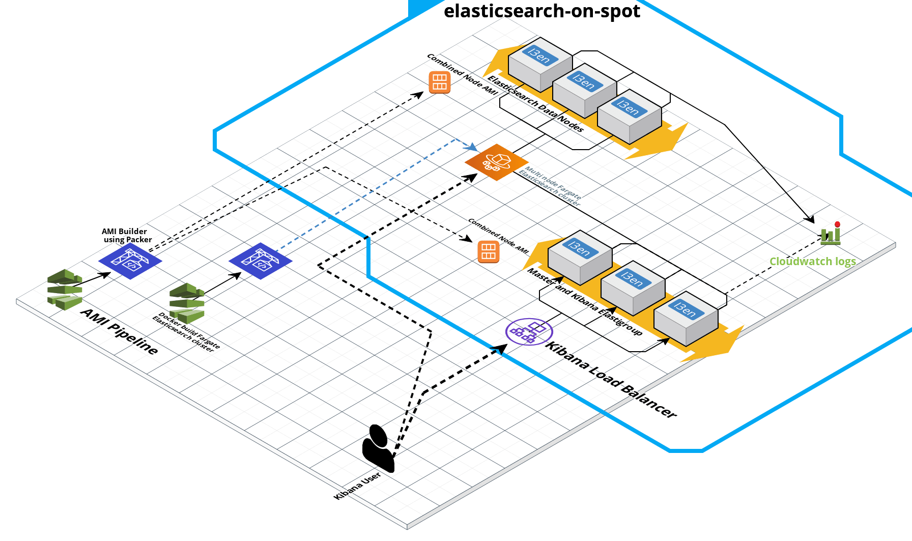

# elasticsearch-on-spot
use SAM to deploy an elasticsearch cluster on AWS EC2

Link:
https://cloudcraft.co/view/a4375794-569b-472d-9be3-afd7e069aaa3?key=kaVj0CBAAtiUNt94a_caZw&interactive=true&embed=true

## Deployment Steps

cd sam-app/
sam validate
sam build
sam deploy --guided